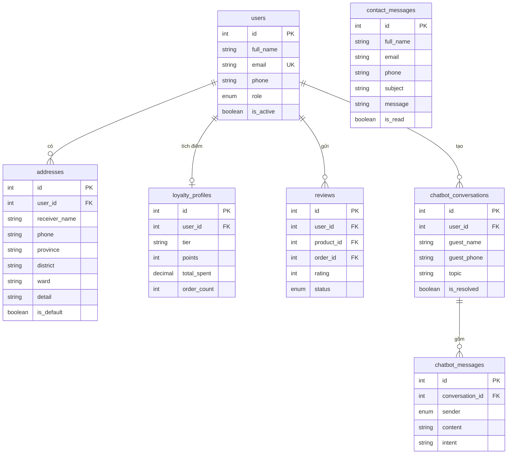
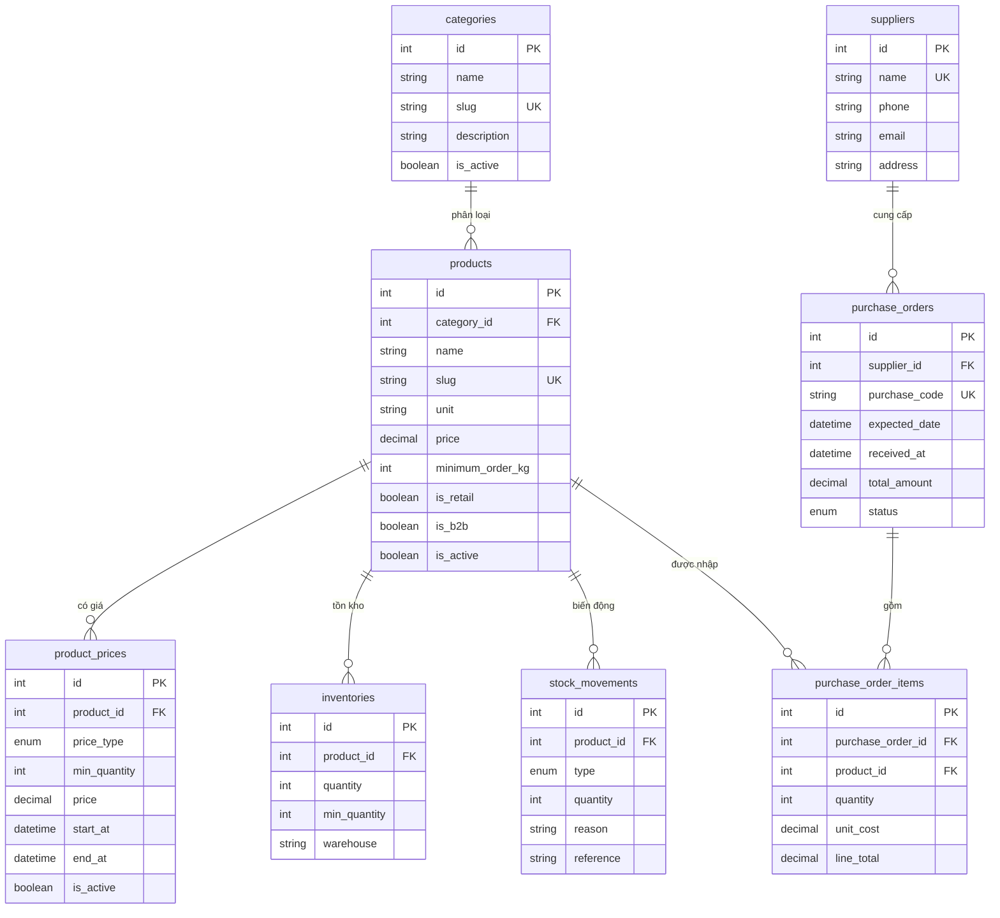
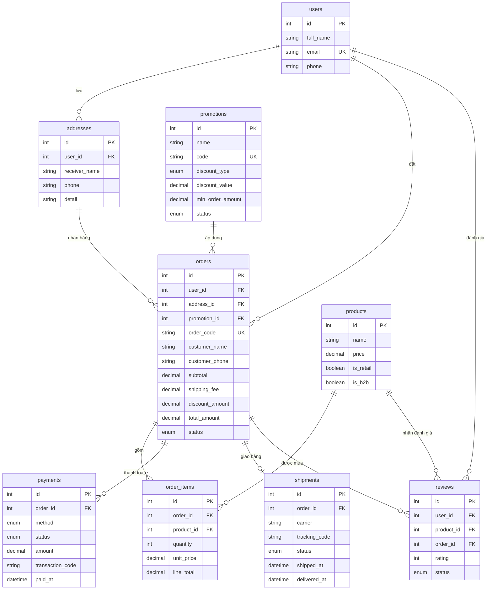
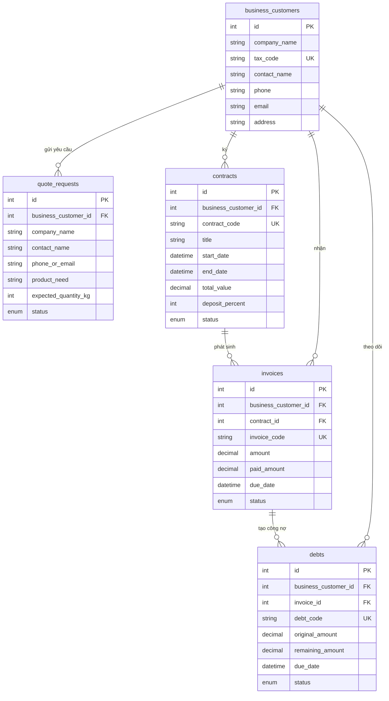
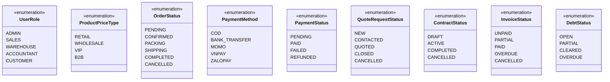

# ERD và Class Diagram - Phú Tài Coffee Works

Tài liệu này tách sơ đồ thành nhiều phần nhỏ để dễ nhìn, dễ chụp màn hình và dễ đưa vào báo cáo đồ án.

## 1. ERD - Tài khoản, khách hàng và tương tác

## 2. ERD - Sản phẩm, bảng giá, kho và mua hàng

## 3. ERD - Bán lẻ B2C, đơn hàng, thanh toán và giao nhận

## 4. ERD - B2B, báo giá, hợp đồng, hóa đơn và công nợ

## 5. Class Diagram tổng quát theo phân hệ

```mermaid
classDiagram
direction LR

namespace TaiKhoan {
    class User {
        +Int id
        +String fullName
        +String email
        +String phone
        +UserRole role
        +Boolean isActive
    }

    class Address {
        +Int id
        +String receiverName
        +String phone
        +String detail
        +Boolean isDefault
    }

    class LoyaltyProfile {
        +Int id
        +String tier
        +Int points
        +Decimal totalSpent
        +Int orderCount
    }
}

namespace SanPhamKho {
    class Category {
        +Int id
        +String name
        +String slug
        +Boolean isActive
    }

    class Product {
        +Int id
        +String name
        +String slug
        +Decimal price
        +Int minimumOrderKg
        +Boolean isRetail
        +Boolean isB2b
    }

    class ProductPrice {
        +Int id
        +ProductPriceType priceType
        +Int minQuantity
        +Decimal price
    }

    class Inventory {
        +Int id
        +Int quantity
        +Int minQuantity
        +String warehouse
    }

    class StockMovement {
        +Int id
        +StockMovementType type
        +Int quantity
        +String reason
    }
}

namespace BanLeB2C {
    class Promotion {
        +Int id
        +String code
        +DiscountType discountType
        +Decimal discountValue
        +PromotionStatus status
    }

    class Order {
        +Int id
        +String orderCode
        +String customerName
        +Decimal totalAmount
        +OrderStatus status
    }

    class OrderItem {
        +Int id
        +Int quantity
        +Decimal unitPrice
        +Decimal lineTotal
    }

    class Payment {
        +Int id
        +PaymentMethod method
        +PaymentStatus status
        +Decimal amount
    }

    class Shipment {
        +Int id
        +String carrier
        +String trackingCode
        +ShipmentStatus status
    }

    class Review {
        +Int id
        +Int rating
        +String content
        +ReviewStatus status
    }
}

namespace DoanhNghiepB2B {
    class BusinessCustomer {
        +Int id
        +String companyName
        +String taxCode
        +String contactName
        +String phone
    }

    class QuoteRequest {
        +Int id
        +String productNeed
        +Int expectedQuantityKg
        +QuoteRequestStatus status
    }

    class Contract {
        +Int id
        +String contractCode
        +Decimal totalValue
        +Int depositPercent
        +ContractStatus status
    }

    class Invoice {
        +Int id
        +String invoiceCode
        +Decimal amount
        +Decimal paidAmount
        +InvoiceStatus status
    }

    class Debt {
        +Int id
        +String debtCode
        +Decimal originalAmount
        +Decimal remainingAmount
        +DebtStatus status
    }
}

namespace ChatbotLienHe {
    class ChatbotConversation {
        +Int id
        +String guestName
        +String topic
        +Boolean isResolved
    }

    class ChatbotMessage {
        +Int id
        +ChatbotSender sender
        +String content
        +String intent
    }

    class ContactMessage {
        +Int id
        +String fullName
        +String phone
        +String subject
        +Boolean isRead
    }
}

User "1" --> "0..*" Address
User "1" --> "0..1" LoyaltyProfile
User "1" --> "0..*" Order
User "1" --> "0..*" Review
User "1" --> "0..*" ChatbotConversation

Category "1" --> "0..*" Product
Product "1" --> "0..*" ProductPrice
Product "1" --> "0..*" Inventory
Product "1" --> "0..*" StockMovement
Product "1" --> "0..*" OrderItem
Product "1" --> "0..*" Review

Promotion "1" --> "0..*" Order
Order "1" --> "1..*" OrderItem
Order "1" --> "0..*" Payment
Order "1" --> "0..1" Shipment
Order "1" --> "0..*" Review

BusinessCustomer "1" --> "0..*" QuoteRequest
BusinessCustomer "1" --> "0..*" Contract
BusinessCustomer "1" --> "0..*" Invoice
BusinessCustomer "1" --> "0..*" Debt
Contract "1" --> "0..*" Invoice
Invoice "1" --> "0..*" Debt

ChatbotConversation "1" --> "0..*" ChatbotMessage
```

## 6. Enum chính

