# Layout Use Case Diagram trên StarUML

Mục tiêu: vẽ theo hướng Actor, ít dây chéo, dễ trình bày trong mục `3.1 Usecase Diagram`.

## Quy ước dựng trong StarUML

- Không vẽ tất cả actor vào một sơ đồ lớn.
- Mỗi sơ đồ chỉ nên có 2-4 actor chính.
- Actor đặt bên trái, use case đặt bên phải theo từng cụm.
- Mỗi actor chỉ nối vào các use case trực tiếp của actor đó.
- Các quan hệ `include/extend` chỉ dùng khi thật cần, tránh làm sơ đồ rối.

## 3.1.1 Sơ đồ tổng quát

Tên diagram trong StarUML: `UC01 - Tong quat he thong`

Actor:

- Khách vãng lai
- Khách lẻ B2C
- Khách doanh nghiệp B2B
- Nhân viên bán hàng
- Nhân viên kho
- Quản trị viên
- Cổng thanh toán
- Đơn vị vận chuyển

Use case:

- Xem và tìm kiếm sản phẩm
- Đăng ký / Đăng nhập
- Gửi liên hệ
- Gửi yêu cầu báo giá B2B
- Mua hàng B2C
- Thanh toán đơn hàng B2C
- Theo dõi đơn hàng
- Quản lý danh mục và sản phẩm
- Quản lý giá B2C / B2B / VIP
- Quản lý tồn kho
- Quản lý đơn hàng
- Quản lý khách hàng B2B
- Quản lý hợp đồng / hóa đơn / công nợ
- Xem báo cáo thống kê

Nối actor:

- Khách vãng lai -> Xem và tìm kiếm sản phẩm
- Khách vãng lai -> Đăng ký / Đăng nhập
- Khách vãng lai -> Gửi liên hệ
- Khách vãng lai -> Gửi yêu cầu báo giá B2B
- Khách lẻ B2C -> Mua hàng B2C
- Khách lẻ B2C -> Thanh toán đơn hàng B2C
- Khách lẻ B2C -> Theo dõi đơn hàng
- Khách doanh nghiệp B2B -> Gửi yêu cầu báo giá B2B
- Khách doanh nghiệp B2B -> Quản lý khách hàng B2B
- Khách doanh nghiệp B2B -> Quản lý hợp đồng / hóa đơn / công nợ
- Nhân viên bán hàng -> Quản lý đơn hàng
- Nhân viên bán hàng -> Quản lý khách hàng B2B
- Nhân viên bán hàng -> Gửi yêu cầu báo giá B2B
- Nhân viên kho -> Quản lý tồn kho
- Nhân viên kho -> Quản lý đơn hàng
- Quản trị viên -> Quản lý danh mục và sản phẩm
- Quản trị viên -> Quản lý giá B2C / B2B / VIP
- Quản trị viên -> Quản lý tồn kho
- Quản trị viên -> Quản lý đơn hàng
- Quản trị viên -> Xem báo cáo thống kê
- Cổng thanh toán -> Thanh toán đơn hàng B2C
- Đơn vị vận chuyển -> Theo dõi đơn hàng

Gợi ý bố cục:

```text
[Actor khách hàng]       [Use case khách hàng]
[Actor nhân viên]        [Use case vận hành]
[Actor ngoài hệ thống]   [Use case thanh toán/giao hàng]
```

## 3.1.2 Sơ đồ chi tiết 1 - Nhóm khách hàng

Tên diagram trong StarUML: `UC02 - Khach hang va mua hang`

Actor:

- Khách vãng lai
- Khách lẻ B2C
- Khách doanh nghiệp B2B
- Cổng thanh toán
- Chatbot AI
- Nhân viên bán hàng

Use case của Khách vãng lai:

- Xem danh sách sản phẩm
- Tìm kiếm / lọc sản phẩm
- Xem chi tiết sản phẩm
- Đăng ký tài khoản
- Gửi liên hệ
- Chatbot tư vấn

Use case của Khách lẻ B2C:

- Đăng nhập
- Cập nhật hồ sơ cá nhân
- Quản lý sổ địa chỉ
- Thêm sản phẩm vào giỏ hàng
- Cập nhật giỏ hàng
- Đặt hàng B2C
- Chọn vận chuyển
- Áp dụng khuyến mãi
- Chọn phương thức thanh toán
- Thanh toán COD
- Thanh toán online
- Theo dõi đơn hàng
- Gửi đánh giá sản phẩm

Use case của Khách doanh nghiệp B2B:

- Đăng ký tài khoản doanh nghiệp
- Cập nhật hồ sơ doanh nghiệp
- Gửi yêu cầu báo giá
- Trao đổi nhu cầu với nhân viên sales
- Theo dõi hợp đồng / hóa đơn / công nợ

Nối actor:

- Khách vãng lai -> Xem danh sách sản phẩm
- Khách vãng lai -> Tìm kiếm / lọc sản phẩm
- Khách vãng lai -> Xem chi tiết sản phẩm
- Khách vãng lai -> Đăng ký tài khoản
- Khách vãng lai -> Gửi liên hệ
- Khách vãng lai -> Chatbot tư vấn
- Khách lẻ B2C -> Đăng nhập
- Khách lẻ B2C -> Cập nhật hồ sơ cá nhân
- Khách lẻ B2C -> Quản lý sổ địa chỉ
- Khách lẻ B2C -> Thêm sản phẩm vào giỏ hàng
- Khách lẻ B2C -> Cập nhật giỏ hàng
- Khách lẻ B2C -> Đặt hàng B2C
- Khách lẻ B2C -> Theo dõi đơn hàng
- Khách lẻ B2C -> Gửi đánh giá sản phẩm
- Khách doanh nghiệp B2B -> Đăng ký tài khoản doanh nghiệp
- Khách doanh nghiệp B2B -> Cập nhật hồ sơ doanh nghiệp
- Khách doanh nghiệp B2B -> Gửi yêu cầu báo giá
- Khách doanh nghiệp B2B -> Trao đổi nhu cầu với nhân viên sales
- Khách doanh nghiệp B2B -> Theo dõi hợp đồng / hóa đơn / công nợ
- Cổng thanh toán -> Thanh toán online
- Chatbot AI -> Chatbot tư vấn
- Nhân viên bán hàng -> Trao đổi nhu cầu với nhân viên sales

Quan hệ include/extend nên dùng:

- Đặt hàng B2C `include` Chọn vận chuyển
- Đặt hàng B2C `include` Chọn phương thức thanh toán
- Đặt hàng B2C `extend` Áp dụng khuyến mãi
- Chọn phương thức thanh toán `extend` Thanh toán COD
- Chọn phương thức thanh toán `extend` Thanh toán online

## 3.1.3 Sơ đồ chi tiết 2 - Nhóm quản trị và vận hành

Tên diagram trong StarUML: `UC03 - Quan tri va van hanh`

Actor:

- Quản trị viên
- Nhân viên bán hàng
- Nhân viên kho
- Kế toán
- Cổng thanh toán
- Đơn vị vận chuyển

Use case của Quản trị viên:

- Quản lý tài khoản
- Phân quyền người dùng
- Quản lý danh mục
- Quản lý sản phẩm
- Quản lý giá B2C / B2B / VIP
- Quản lý khuyến mãi
- Xem báo cáo thống kê

Use case của Nhân viên bán hàng:

- Xem danh sách khách hàng
- Quản lý khách B2B
- Xem yêu cầu báo giá
- Cập nhật trạng thái báo giá
- Tiếp nhận đơn hàng
- Cập nhật trạng thái đơn hàng
- Xem / xử lý tin nhắn liên hệ

Use case của Nhân viên kho:

- Xem tồn kho
- Nhập kho sản phẩm
- Điều chỉnh tồn kho
- Theo dõi cảnh báo hết hàng
- Chuẩn bị giao hàng

Use case của Kế toán:

- Xác nhận thanh toán
- Quản lý hóa đơn B2B
- Quản lý công nợ B2B
- Theo dõi doanh thu

Tác nhân ngoài:

- Cổng thanh toán -> Xử lý giao dịch online
- Đơn vị vận chuyển -> Cập nhật vận đơn

Quan hệ include/extend nên dùng:

- Tiếp nhận đơn hàng `include` Xác nhận thanh toán
- Xác nhận thanh toán `extend` Xử lý giao dịch online
- Chuẩn bị giao hàng `include` Cập nhật vận đơn
- Theo dõi cảnh báo hết hàng `extend` Nhập kho sản phẩm

## PlantUML tham khảo - tổng quát ít dây

Nếu cần render nhanh trước khi dựng StarUML:

```plantuml
@startuml
top to bottom direction
skinparam packageStyle rectangle
skinparam linetype ortho

actor "Khách vãng lai" as Guest
actor "Khách lẻ B2C" as B2C
actor "Khách doanh nghiệp B2B" as B2B
actor "Nhân viên bán hàng" as Sales
actor "Nhân viên kho" as Warehouse
actor "Quản trị viên" as Admin
actor "Cổng thanh toán" as Payment
actor "Đơn vị vận chuyển" as Shipper

rectangle "Hệ thống TMĐT Phú Tài Coffee Works" {
  usecase "Xem và tìm kiếm sản phẩm" as UC1
  usecase "Đăng ký / Đăng nhập" as UC2
  usecase "Gửi liên hệ" as UC3
  usecase "Gửi yêu cầu báo giá B2B" as UC4
  usecase "Mua hàng B2C" as UC5
  usecase "Thanh toán đơn hàng B2C" as UC6
  usecase "Theo dõi đơn hàng" as UC7
  usecase "Quản lý danh mục và sản phẩm" as UC8
  usecase "Quản lý giá B2C / B2B / VIP" as UC9
  usecase "Quản lý tồn kho" as UC10
  usecase "Quản lý đơn hàng" as UC11
  usecase "Quản lý khách hàng B2B" as UC12
  usecase "Quản lý hợp đồng / hóa đơn / công nợ" as UC13
  usecase "Xem báo cáo thống kê" as UC14
}

Guest --> UC1
Guest --> UC2
Guest --> UC3
Guest --> UC4

B2C --> UC1
B2C --> UC5
B2C --> UC6
B2C --> UC7

B2B --> UC1
B2B --> UC4
B2B --> UC12
B2B --> UC13

Sales --> UC4
Sales --> UC11
Sales --> UC12

Warehouse --> UC10
Warehouse --> UC11

Admin --> UC8
Admin --> UC9
Admin --> UC10
Admin --> UC11
Admin --> UC14

Payment --> UC6
Shipper --> UC7
@enduml
```


